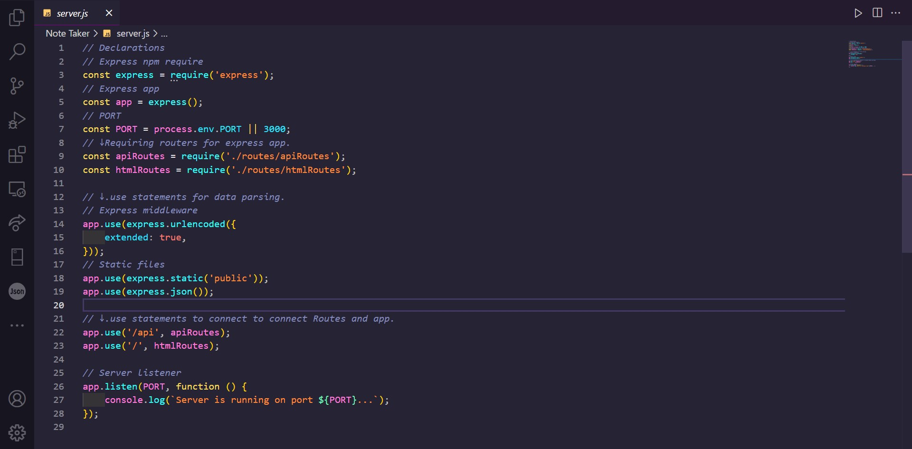

# 
 **Note Taker app (w/ express.js)** 

---

## 
 _Description_ 

A Note taking app created using express.js + json with get, post and delete functions. App is to be deployed to Heroku.

## 
 _Languages Used_ 

Html,CSS,Javascript,Node.js,Express.js

---

## _Table of Contents_

- [Installation](#Installation)
- [Usage](#Usage)
- [Links](#Links)
- [Credits](#Credits)
- [Licence](#Licence)
- [Badges](#Badges)
- [Questions](#Questions)
- [Tests](#Tests)

---

## _Installation_

Type `npm i` or `npm install`, in terminal, which will install the required node_modules (in this case express pkg) package dependencies folder in directory.   A quick preview of the js codes that were added to make the app work (public and db folders were from starter codes):   store.js file:    routes folder js files:     And server.js:   

## _Usage_

Once that is done, in terminal type `node server.js` or `npm start`, to start the server up which will give the console log of `"server is running on port (number)..."`      After that open a new browser window and type `http://localhost:(port number)` in search bar (replace the "(port number)" with the actual number used in server.js file) to start the app locally. or click the mentioned deployed link (Per assignment requirements Heroku was used for deployment). Once on the site, click the `get started` button to proceed to the main app page. Typing a title (and/or text content) makes the save icon (right beside the plus icon) visible. Click the save ison to store the notes. To delete them click the bin icon right besides the note itself.

## _Links_

Github Links

> [Note taker repo](https://github.com/A-N26/Note-Taker.git)

- > [Heroku](https://note-taker-app-deployment.herokuapp.com/)

## _Credits_

Started with starter code that was provided for the challenge and had help from AskBCS.   Used [dev.to](https://dev.to/envoy_/150-badges-for-github-pnk#ide) link for some `badges`.   Google/Youtube

## _License_

**(Please Click the BADGE for the license details.)**

## _Badges_

     

## _Questions_

If you would like to as me anything (ama) about the project, please contact me on the info mentioned below:

Contact Me

- [My GitHub Profile](https://github.com/A-N26)

- [My e-mail](A-N26@github.com)

## _Contributing_

Please do not hesitate to fork this repo. And, there-after, create a new branch and commit, push that branch and create a pull request.☻

## _Tests_

n/a
